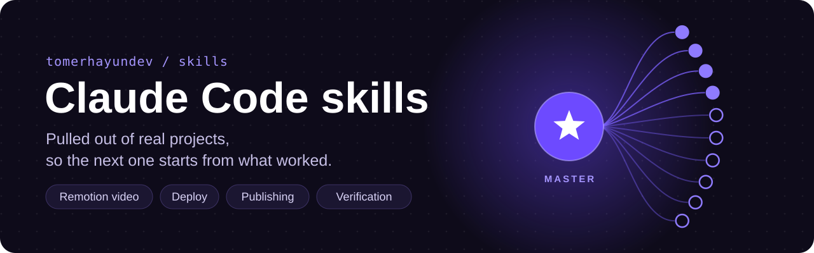

<p align="center">
  
</p>

<p align="center">
  <a href="https://github.com/tomerhayundev/skills/actions/workflows/validate.yml"></a>
  <a href="https://code.claude.com/docs"></a>
  <a href="https://agentskills.io"></a>
  <a href="LICENSE"></a>
</p>

<p align="center">
  <a href="#quick-start"><b>Quick start</b></a> &nbsp;·&nbsp;
  <a href="#remotion-video"><b>Remotion video</b></a> &nbsp;·&nbsp;
  <a href="#more-skills"><b>More skills</b></a> &nbsp;·&nbsp;
  <a href="#how-this-repo-is-kept"><b>How it's kept</b></a>
</p>

Skills and plugins for [Claude Code](https://code.claude.com/docs), each one pulled out of a real
project so the next project starts from what worked. Install one, and it triggers on its own when a
task matches.

## Quick start

```bash
# 1. Add the marketplace (once per machine)
claude plugin marketplace add https://github.com/tomerhayundev/skills.git

# 2. Install what you need, for example the master video skill
claude plugin install remotion-video-master@tomerhayundev-skills
```

Restart Claude Code (or run `/reload-plugins`). Inside a session the same steps are
`/plugin marketplace add <url>` and `/plugin install <name>@tomerhayundev-skills`.

<details>
<summary><b>Updates, removing a skill, and other ways to install</b></summary>

<br>

**Get updates.** Run both, then restart Claude Code: the first refreshes the catalog, the second
moves the installed copy to the latest version.

```bash
claude plugin marketplace update tomerhayundev-skills
claude plugin update <name>@tomerhayundev-skills
```

Or turn on auto-update once: `/plugin` > Marketplaces > tomerhayundev-skills > Enable auto-update.
Remove one with `claude plugin uninstall <name>@tomerhayundev-skills`.

**SSH.** The `tomerhayundev/skills` shorthand also works, but it clones over SSH, so it fails on a
machine without a GitHub SSH key unless `CLAUDE_CODE_PLUGIN_PREFER_HTTPS=1` is set.

**Without the plugin system**, copy a skill into your personal skills folder; it loads in every session:

```bash
git clone https://github.com/tomerhayundev/skills.git
cp -r skills/plugins/<name>/skills/<name> ~/.claude/skills/<name>
```

**Other agents** that support [Agent Skills](https://agentskills.io) (Codex, Cursor, opencode, and more):

```bash
npx skills add https://github.com/tomerhayundev/skills --skill <name>
```

</details>

<!-- catalog -->
## Remotion video

One master skill that makes every kind of Remotion video, and ten specialists broken out of it.

<table>
<tr>
<td>


### [remotion-video-master](plugins/remotion-video-master/skills/remotion-video-master/SKILL.md)

**Every kind of Remotion video, in one skill.** Say "make a video for my app" and it brainstorms
with you before it builds anything.

- **Brief first.** What the video is for, where it runs, and a length recommended for those platforms.
- **The story is the core.** One message, a timed script and hooks to choose from, approved before
  anything moves.
- **One engine.** The brand's own motif in every transition, beat-locked music, each platform's safe
  zones, one manifest for every aspect and language.
- **Measured, not eyeballed.** Frame-pop and loudness checks, a phone-size contact sheet, and a
  critique loop until every score is 8 or more.
- **Every format.** Promo, product demo, tutorial, explainer, and six more, each with its own rules.
- **References built in.** With no reference from you, it pulls one from the [sources library](sources/README.md):
  the exact page for the move it needs, how to read it and what to take, never a copy.

```bash
claude plugin install remotion-video-master@tomerhayundev-skills
```

</td>
</tr>
</table>

### The specialists: one kind of video each

Each specialist is the master broken out for a single kind of video, for when you only ever make that
one: the same engine and checks, with the goal already set. They are **generated from the master**, so
every improvement to it reaches all of them. Install the master for everything, or only the specialists
you need; with the master installed you need none of them.

```mermaid
flowchart TB
  master(["&#11088; THE MASTER<br/>remotion-video-master<br/>every format in one skill"]):::master
  subgraph full["Specialists"]
    direction LR
    s0["Promo"]:::spec ~~~ s1["Product demo"]:::spec
    s2["Tutorial"]:::spec ~~~ s3["Explainer"]:::spec
  end
  subgraph early["Early specialists, built on a full one"]
    direction LR
    s4["Feature announcement"]:::early ~~~ s5["Social clip"]:::early ~~~ s6["Event recap"]:::early
    s7["App store preview"]:::early ~~~ s8["Onboarding"]:::early ~~~ s9["Testimonial"]:::early
  end
  master ==> full
  master ==> early
  classDef master fill:#6d4aff,stroke:#4a2fd1,stroke-width:3px,color:#ffffff,font-weight:bold
  classDef spec fill:#ece7ff,stroke:#6d4aff,stroke-width:1.5px,color:#2b1d70
  classDef early fill:#f7f5ff,stroke:#8f7bff,stroke-width:1.5px,stroke-dasharray:5 4,color:#4a3a9a
  style full fill:transparent,stroke:#6d4aff
  style early fill:transparent,stroke:#8f7bff,stroke-dasharray:5 4
  linkStyle 6,7 stroke:#6d4aff,stroke-width:2.5px
```

<!-- family:remotion-video-master -->


| Specialist | What it does | Install |
| --- | --- | --- |
| [remotion-video-promo](plugins/remotion-video-promo/skills/remotion-video-promo/SKILL.md) | Promo videos with Remotion: bumpers, 15 and 30 s ads, teasers, launch films and landing page loops. Beat-locked, the brand's motif carrying the turn and the close, four aspects and RTL locales from one manifest. | `claude plugin install remotion-video-promo@tomerhayundev-skills` |
| [remotion-video-product-demo](plugins/remotion-video-product-demo/skills/remotion-video-product-demo/SKILL.md) | Product demo and product tour videos with Remotion: the real product, feature by feature, driven by a cursor with smooth zooms, voiced or caption-led, with cuts only inside screen recordings. | `claude plugin install remotion-video-product-demo@tomerhayundev-skills` |
| [remotion-video-tutorial](plugins/remotion-video-tutorial/skills/remotion-video-tutorial/SKILL.md) | Tutorial and how-to videos with Remotion: step by step, chaptered by the brand's motif, a voiceover or word-synced subtitles, cursor zooms, checked so a stranger can repeat every step. | `claude plugin install remotion-video-tutorial@tomerhayundev-skills` |
| [remotion-video-explainer](plugins/remotion-video-explainer/skills/remotion-video-explainer/SKILL.md) | Explainer videos with Remotion: one idea made clear with diagrams and the brand's motif, voiced or caption-led, checked for one-sentence recall. | `claude plugin install remotion-video-explainer@tomerhayundev-skills` |
| [remotion-video-feature-announcement](plugins/remotion-video-feature-announcement/skills/remotion-video-feature-announcement/SKILL.md) | Feature announcement videos with Remotion: one new feature or release, before and after on the same screen, in a short film.<br/><sub>Early: built on the promo module until it gets its own.</sub> | `claude plugin install remotion-video-feature-announcement@tomerhayundev-skills` |
| [remotion-video-social-organic](plugins/remotion-video-social-organic/skills/remotion-video-social-organic/SKILL.md) | Organic social clips with Remotion for Reels, TikTok, Shorts and LinkedIn: the hook in the first second, captions inside every platform's safe zone, made to loop and be shared.<br/><sub>Early: built on the promo module until it gets its own.</sub> | `claude plugin install remotion-video-social-organic@tomerhayundev-skills` |
| [remotion-video-event-recap](plugins/remotion-video-event-recap/skills/remotion-video-event-recap/SKILL.md) | Event recap and conference highlight videos with Remotion, cut from real footage and photos on the beat.<br/><sub>Early: built on the promo module until it gets its own.</sub> | `claude plugin install remotion-video-event-recap@tomerhayundev-skills` |
| [remotion-video-app-store-preview](plugins/remotion-video-app-store-preview/skills/remotion-video-app-store-preview/SKILL.md) | App Store previews and Google Play videos with Remotion: in-app footage only, 15 to 30 s, caption-led for muted autoplay, at the store's exact size.<br/><sub>Early: built on the product demo module until it gets its own.</sub> | `claude plugin install remotion-video-app-store-preview@tomerhayundev-skills` |
| [remotion-video-onboarding](plugins/remotion-video-onboarding/skills/remotion-video-onboarding/SKILL.md) | Onboarding and first-run videos with Remotion: a series of short tutorials, one task each, caption-led for in-product playback.<br/><sub>Early: built on the tutorial module until it gets its own.</sub> | `claude plugin install remotion-video-onboarding@tomerhayundev-skills` |
| [remotion-video-testimonial](plugins/remotion-video-testimonial/skills/remotion-video-testimonial/SKILL.md) | Customer testimonial and case study videos with Remotion, built from a real customer's quote, interview or numbers.<br/><sub>Early: built on the explainer module until it gets its own.</sub> | `claude plugin install remotion-video-testimonial@tomerhayundev-skills` |
<!-- /family:remotion-video-master -->

> [!NOTE]
> `remotion-video-promo` was called `remotion-video-pipeline` until 2026-09-28. An installed copy moves
> to the new name when the catalog updates; then install it once (updating the old name reports "not
> found"): `claude plugin install remotion-video-promo@tomerhayundev-skills`

## More skills

| Skill | What it does | Install |
| --- | --- | --- |
| [deploy-production-level](plugins/deploy-production-level/skills/deploy-production-level/SKILL.md) | Production deploy pipeline on GitHub Actions and Cloudflare Workers: a required quality gate, PR preview environments, staging on every merge, human-promoted production releases tagged with their Worker version, instant rollback, and a hook that stops AI agents from deploying. Invoke it explicitly. | `claude plugin install deploy-production-level@tomerhayundev-skills` |
| [publish-skill](plugins/publish-skill/skills/publish-skill/SKILL.md) | Publish a skill or plugin to your Claude Code marketplace repos: routes public vs private, scaffolds the entry and README row, scans for secrets and private content, validates, test-installs in a throwaway config, and keeps a local copy. Includes a history-purge recipe for leaks. | `claude plugin install publish-skill@tomerhayundev-skills` |
| [visual-verification](plugins/visual-verification/skills/visual-verification/SKILL.md) | Makes the agent prove an output works before calling it done: scope the check from the user's words, verify on the real surface and environment (never tests, CI, health checks or localhost alone), screenshot it, use it (click, submit, run, open every page), read the evidence critically, and report each item as ✓/✗/?, in a strict tool order (real Chrome, in-app browser, headless Playwright, computer use), with a tool-traps guide, a rationalization table and red flags. | `claude plugin install visual-verification@tomerhayundev-skills` |
| [seo-geo-master](plugins/seo-geo-master/skills/seo-geo-master/SKILL.md) | One master skill for search visibility: classic SEO and GEO (being found, cited and recommended in Google AI Overviews and AI Mode, ChatGPT, Claude, Perplexity and Copilot). Reads the site first, asks once, never invents numbers, proposes one measured change at a time, and ships tested zero-dependency scripts for crawling, robots.txt and AI crawlers, structured data, Search Console exports and Core Web Vitals. | `claude plugin install seo-geo-master@tomerhayundev-skills` |
| [brand-identity-master](plugins/brand-identity-master/skills/brand-identity-master/SKILL.md) | Turns a logo into a visual identity: it reads the logo's real colours and shape and the brand's own words, picks one of six design directions, and writes a validated brand file (brand.json, DESIGN.md, tokens.css) plus a premium brand identity board rendered from HTML by headless Chrome or Edge. The logo is never redrawn, no fact is invented, and no image model or API key is needed. | `claude plugin install brand-identity-master@tomerhayundev-skills` |
<!-- /catalog -->

## The sources library

The skills look up references in [one shared catalog](sources/README.md) instead of browsing: design
and motion sites, each with the exact page for each need ("a transition", "a hero", "an app flow"),
how a machine reads it (a page, its screenshots, a clip's frames, a code registry), who may use what,
and what to take and never take. A skill runs one query and goes straight to the right page:

```bash
node scripts/find-sources.mjs --need=transition --format=promo
```

It reads the live catalog here first, so a new source reaches every installed skill at once. Sources
are added from shared links: each site is opened, mapped and checked before it goes in, and a monthly
job records the ones that died or went behind a paywall.

## How this repo is kept

Nobody maintains this repo by hand. The [skills-maintainer](.claude/agents/skills-maintainer.md) agent
adds, updates, renames and retires skills by the rules in [MAINTAINING.md](MAINTAINING.md), and CI
keeps every change honest.

| When | What happens |
| --- | --- |
| The master changes | `scripts/sync.mjs` regenerates every specialist, its catalog entry and the tables on this page |
| Any plugin changes | its version is bumped, so installed copies (CLI and Cowork) update |
| Every push to `main` | checks, strict plugin validation and tests run; if a change skipped the sync, CI runs it and commits the result |
| Any file, any time | no real company, client or competitor name: the check holds a list of them as salted hashes and fails on any. The sources library is the one place reference sites are named, as tools |
| The sources catalog changes | it is validated, copied into every skill that uses it, and those skills are bumped; monthly, every source is loaded again |

<details>
<summary><b>Layout</b></summary>

<br>

```
.claude-plugin/marketplace.json                 the catalog: one entry per plugin
plugins/<name>/.claude-plugin/plugin.json       name, version, description, author
plugins/<name>/skills/<name>/SKILL.md           a skill (+ references/, scripts/, assets/)
plugins/<name>/commands/, agents/, hooks/       other components, when a plugin has them
plugins/remotion-video-<format>/                specialists, generated from remotion-video-master
archive/<name>/                                 retired plugins, kept as they were, not in the catalog
scripts/sync.mjs                                versions, specialists, catalog entries, README tables
scripts/check-skills.mjs                        repo checks CI runs on every push
scripts/sources.mjs                             the sources library's tool: validate, add, check
sources/catalog.json                            the sources library, copied into the skills that use it
MAINTAINING.md                                  how the repo is kept, and by whom
.claude/agents/skills-maintainer.md             the agent that keeps it
```

Every entry is a full plugin: `"source": "./plugins/<name>"`, with its own `plugin.json`, and no
`strict` or `skills` key. Cowork installs only entries shaped like that; it silently skips skill-only
entries, which the Claude Code CLI would accept.

</details>

<details>
<summary><b>Changing a skill by hand</b></summary>

<br>

- **A specialist is never edited.** Change `remotion-video-master` (its `SKILL.md`, a
  `formats/<format>/FORMAT.md`, or a shared file), then run `node scripts/sync.mjs`. A hand edit to a
  specialist stops the sync and fails CI.
- **Every change bumps the plugin's `version`**, or installed copies never update. The sync bumps the
  patch version of anything you changed; CI does the same on every push to `main`.
- **A new skill** goes through the [publish-skill](plugins/publish-skill/skills/publish-skill/SKILL.md)
  flow: scaffold, scan, checks, test install, push.

```bash
node scripts/sync.mjs
node scripts/check-skills.mjs
claude plugin validate . --strict
```

</details>

## Archived

No longer maintained. Kept as they were, but out of the catalog, so `claude plugin install`
no longer finds them. Copies already installed keep working and get no updates. To use
one anyway, copy its skill folder into `~/.claude/skills/`.

| Name | What it does |
| --- | --- |
| [wix-app-dev](archive/wix-app-dev/skills/wix-app-dev/SKILL.md) | Design, build and ship Wix App Market apps: architecture, instance-token auth, webhooks, Blocks widgets, a Cloudflare Workers + D1 backend, billing, submission. |

## License

[CC BY-ND 4.0](LICENSE): you may use these skills, also at work, and share them unchanged with
credit, but not publish changed versions. The exception is the bundled music track in
`plugins/remotion-video-master/skills/remotion-video-master/assets/music/` (and its copy in each
`remotion-video-*` specialist), which is Sascha Ende's work under CC BY 4.0 (see its
[CREDITS.md](plugins/remotion-video-master/skills/remotion-video-master/assets/music/CREDITS.md)).

The `brand-identity-master` skill bundles open-licensed fonts (SIL Open Font License 1.1, unmodified,
each with its licence file). Its method adapts ideas, with no text copied, from an MIT-licensed design
skill pack and two Apache-2.0 design skills, and its icons were drawn for it (see its
[CREDITS.md](plugins/brand-identity-master/skills/brand-identity-master/CREDITS.md)).
